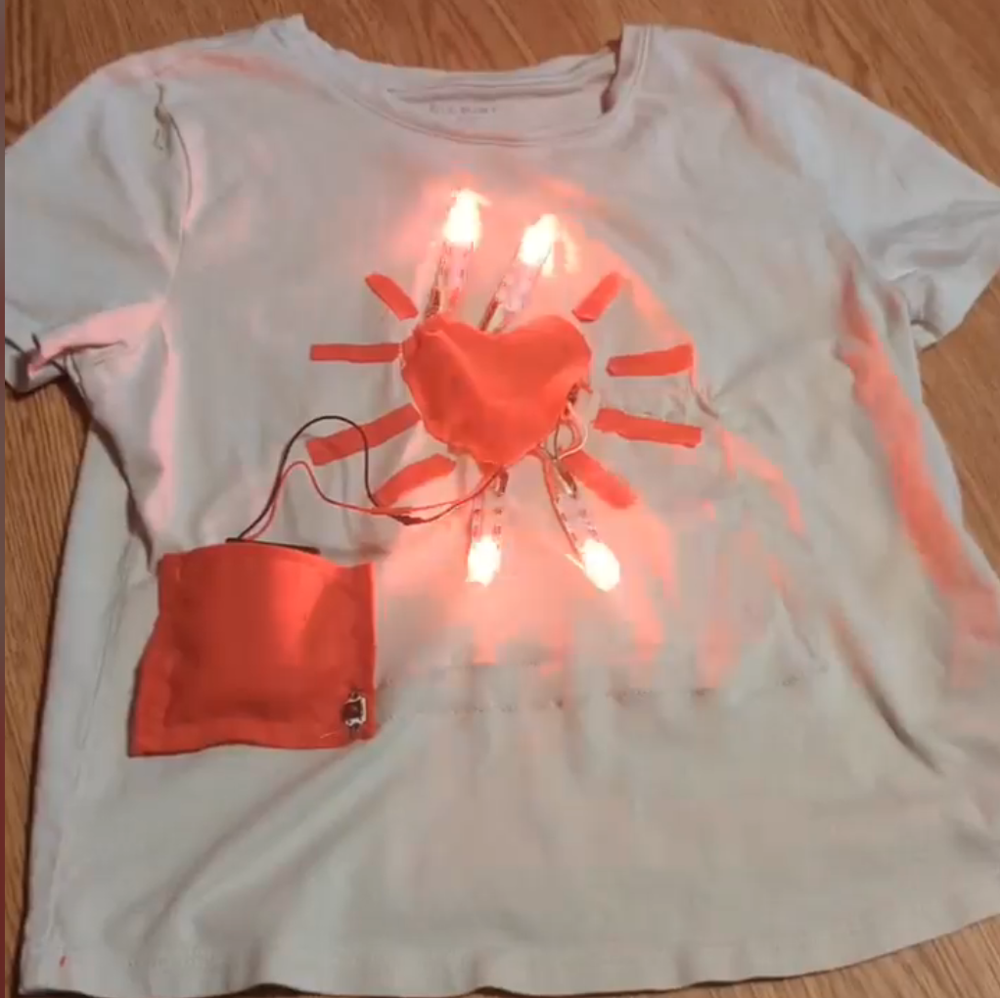

# Variable Beaming Heart

Button-cycled NeoPixel heart animation for Adafruit Flora (legacy).

## Photo


## Features
- Three LED effects: traveling red pulse, rainbow cycle, and white sparkle.
- Button press advances to the next effect.
- Debounced button handling (`INPUT_PULLUP` + software debounce).
- Non-blocking effect updates for responsive mode switching.
- Serial debug output prints the selected effect index.

## Controls
- Push button on `D10`: cycle effect mode (`0 -> 1 -> 2 -> 0`).

## Hardware
- Adafruit Flora (legacy).
- 4-pixel NeoPixel strip/ring.
- Momentary push button.
- Jumper wires.
- Optional external 5V supply for cleaner LED power.

## Wiring
- NeoPixel `DIN` -> `D6`
- NeoPixel `VCC` -> `5V`
- NeoPixel `GND` -> `GND`
- Button leg 1 -> `D10`
- Button leg 2 -> `GND`

Note: The sketch uses `INPUT_PULLUP`, so the button is active-low (`LOW` when pressed).

```text
Adafruit Flora (legacy)         NeoPixel
-------                         --------
D6  --------------------------> DIN
5V  --------------------------> VCC
GND --------------------------> GND

Adafruit Flora (legacy)         Push Button
-------                         -----------
D10 --------------------------> Leg 1
GND --------------------------> Leg 2
```

## Tuning
Key constants in `variable_beaming_heart.ino`:
- Pins and count: `BUTTON_PIN`, `NEOPIXEL_PIN`, `NUMPIXELS`
- Debounce: `debounceDelay`
- Effect timing:
  - `nonBlockingTravelingPulse(..., wait, ...)`
  - `nonBlockingRainbow(..., wait)`
  - `nonBlockingSparkle(..., wait)`

## Changelog
- Added button-controlled effect cycling with debounce.
- Converted effects to non-blocking update style.
- Added three selectable modes: pulse, rainbow, sparkle.
